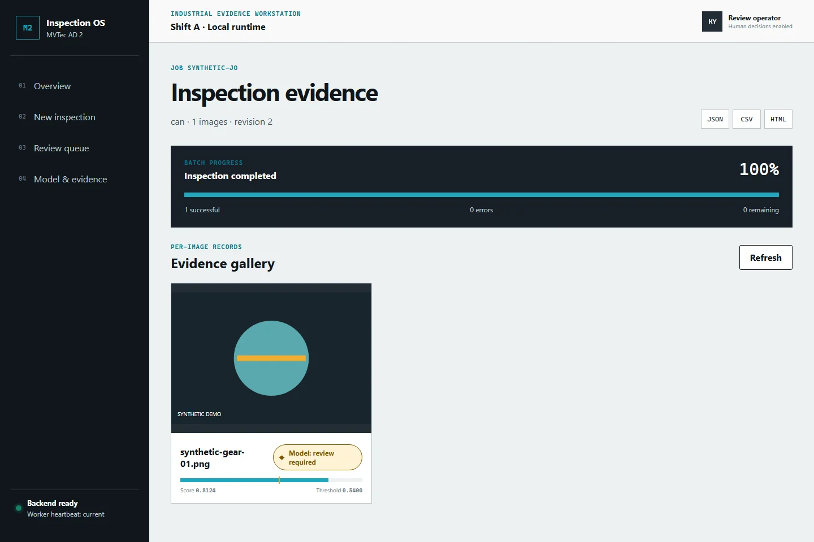
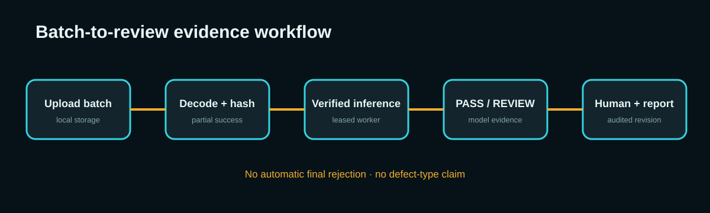
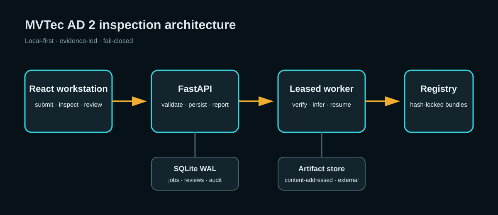

# MVTec AD 2 Industrial Inspection Platform



A local-first industrial anomaly-inspection workstation that turns frozen benchmark evidence into a resumable batch, visual review, and auditable human-decision workflow.

The public portfolio proves three things without redistributing MVTec data: **8 category-specific champions** <!-- claim:8|reports/champions.json|/champions|len --> selected from **56 formal public runs** <!-- claim:56|reports/public_benchmark.json|/runs|len -->, an end-to-end product exercised with visibly synthetic fixtures, and fail-closed boundaries around model identity, uploads, recovery, reports, and deletion. The frozen official private gate is classified `PRIVATE-NO-GO`.

## Product workflow



An operator selects a category and submits a batch. Valid images continue even when another image is corrupt. A dedicated leased worker verifies the selected bundle before inference, stores model evidence as `PASS` or `REVIEW`, and resumes idempotently after an expired lease. A human owns final disposition and every report preserves model and human decisions separately.

The screenshots in this repository are generated only from `fixtures/public-demo`; they contain no MVTec pixels and do not imply production deployment.

## Evidence, not a leaderboard claim

- The frozen champion matrix is in [reports/champions.json](reports/champions.json), with its readable summary in [reports/benchmark.md](reports/benchmark.md).
- Public selection uses image AUROC, pixel AU-PRO, confidence intervals, latency, VRAM, and artifact size under the approved metric contract.
- Per-category winners are PatchCore for `can`, `vial`, `wallplugs`, and `walnuts`; Dinomaly for `fabric`, `fruit_jelly`, `rice`, and `sheet_metal`.
- EfficientAD remains a benchmarked candidate, not a selected champion.
- The one authorized frozen archive passed the official local validator, was evaluated once by the official server, and was not regenerated or resubmitted after the result.

## Official private gate

The official server returned AucPro_0.05 averages of **31.24** <!-- claim:31.24|docs/assets/evidence/official-private-result.json|/metrics/private/auc_pro_0_05/average|.2f --> for `private` and **29.81** <!-- claim:29.81|docs/assets/evidence/official-private-result.json|/metrics/private_mixed/auc_pro_0_05/average|.2f --> for `private_mixed`. This is classified `PRIVATE-NO-GO`, preserving the precommitted rule that material mixed-lighting failure is reported rather than tuned away.

The submitted archive contained all 4,090 TIFF anomaly maps but no optional thresholded PNGs. The official ClassF1 and SegF1 values are therefore zero and are not interpreted as measured thresholded-map performance. The reviewed per-category aggregates and evidence hashes are in [official-private-result.json](docs/assets/evidence/official-private-result.json); raw server evidence remains outside Git.

## Verified local serving performance

All eight frozen champions passed clean-process product inference on the recorded RTX 4090 workstation. Measurements use batch size **1** <!-- claim:1|docs/assets/evidence/serving-benchmark.json|/configuration/batch_size|d -->, **3** warmups <!-- claim:3|docs/assets/evidence/serving-benchmark.json|/configuration/warmup_repetitions|d -->, and **20** timed GPU repetitions <!-- claim:20|docs/assets/evidence/serving-benchmark.json|/configuration/gpu_repetitions|d --> per category. These are local measurements, not production guarantees.

| Category | Family | GPU p50 (ms) | GPU p95 (ms) | Peak reserved VRAM (MiB) | Bundle bytes |
|---|---|---:|---:|---:|---:|
| can | PatchCore | 155.2 <!-- claim:155.2|docs/assets/evidence/serving-benchmark.json|/categories/can/gpu/p50_latency_ms|.1f --> | 173.2 <!-- claim:173.2|docs/assets/evidence/serving-benchmark.json|/categories/can/gpu/p95_latency_ms|.1f --> | 4388.0 <!-- claim:4388.0|docs/assets/evidence/serving-benchmark.json|/categories/can/gpu/peak_reserved_vram_mib|.1f --> | 3,409,718,327 <!-- claim:3,409,718,327|docs/assets/evidence/serving-benchmark.json|/categories/can/artifact_size_bytes|,d --> |
| fabric | Dinomaly | 167.4 <!-- claim:167.4|docs/assets/evidence/serving-benchmark.json|/categories/fabric/gpu/p50_latency_ms|.1f --> | 184.9 <!-- claim:184.9|docs/assets/evidence/serving-benchmark.json|/categories/fabric/gpu/p95_latency_ms|.1f --> | 2408.0 <!-- claim:2408.0|docs/assets/evidence/serving-benchmark.json|/categories/fabric/gpu/peak_reserved_vram_mib|.1f --> | 1,776,166,311 <!-- claim:1,776,166,311|docs/assets/evidence/serving-benchmark.json|/categories/fabric/artifact_size_bytes|,d --> |
| fruit jelly | Dinomaly | 66.9 <!-- claim:66.9|docs/assets/evidence/serving-benchmark.json|/categories/fruit_jelly/gpu/p50_latency_ms|.1f --> | 72.1 <!-- claim:72.1|docs/assets/evidence/serving-benchmark.json|/categories/fruit_jelly/gpu/p95_latency_ms|.1f --> | 2388.0 <!-- claim:2388.0|docs/assets/evidence/serving-benchmark.json|/categories/fruit_jelly/gpu/peak_reserved_vram_mib|.1f --> | 1,776,166,311 <!-- claim:1,776,166,311|docs/assets/evidence/serving-benchmark.json|/categories/fruit_jelly/artifact_size_bytes|,d --> |
| rice | Dinomaly | 170.4 <!-- claim:170.4|docs/assets/evidence/serving-benchmark.json|/categories/rice/gpu/p50_latency_ms|.1f --> | 177.2 <!-- claim:177.2|docs/assets/evidence/serving-benchmark.json|/categories/rice/gpu/p95_latency_ms|.1f --> | 2408.0 <!-- claim:2408.0|docs/assets/evidence/serving-benchmark.json|/categories/rice/gpu/peak_reserved_vram_mib|.1f --> | 1,776,166,311 <!-- claim:1,776,166,311|docs/assets/evidence/serving-benchmark.json|/categories/rice/artifact_size_bytes|,d --> |
| sheet metal | Dinomaly | 63.2 <!-- claim:63.2|docs/assets/evidence/serving-benchmark.json|/categories/sheet_metal/gpu/p50_latency_ms|.1f --> | 65.8 <!-- claim:65.8|docs/assets/evidence/serving-benchmark.json|/categories/sheet_metal/gpu/p95_latency_ms|.1f --> | 2402.0 <!-- claim:2402.0|docs/assets/evidence/serving-benchmark.json|/categories/sheet_metal/gpu/peak_reserved_vram_mib|.1f --> | 1,776,166,311 <!-- claim:1,776,166,311|docs/assets/evidence/serving-benchmark.json|/categories/sheet_metal/artifact_size_bytes|,d --> |
| vial | PatchCore | 101.3 <!-- claim:101.3|docs/assets/evidence/serving-benchmark.json|/categories/vial/gpu/p50_latency_ms|.1f --> | 111.9 <!-- claim:111.9|docs/assets/evidence/serving-benchmark.json|/categories/vial/gpu/p95_latency_ms|.1f --> | 3232.0 <!-- claim:3232.0|docs/assets/evidence/serving-benchmark.json|/categories/vial/gpu/peak_reserved_vram_mib|.1f --> | 2,496,191,543 <!-- claim:2,496,191,543|docs/assets/evidence/serving-benchmark.json|/categories/vial/artifact_size_bytes|,d --> |
| wallplugs | PatchCore | 134.9 <!-- claim:134.9|docs/assets/evidence/serving-benchmark.json|/categories/wallplugs/gpu/p50_latency_ms|.1f --> | 144.1 <!-- claim:144.1|docs/assets/evidence/serving-benchmark.json|/categories/wallplugs/gpu/p95_latency_ms|.1f --> | 3274.0 <!-- claim:3274.0|docs/assets/evidence/serving-benchmark.json|/categories/wallplugs/gpu/peak_reserved_vram_mib|.1f --> | 2,511,287,351 <!-- claim:2,511,287,351|docs/assets/evidence/serving-benchmark.json|/categories/wallplugs/artifact_size_bytes|,d --> |
| walnuts | PatchCore | 239.7 <!-- claim:239.7|docs/assets/evidence/serving-benchmark.json|/categories/walnuts/gpu/p50_latency_ms|.1f --> | 259.8 <!-- claim:259.8|docs/assets/evidence/serving-benchmark.json|/categories/walnuts/gpu/p95_latency_ms|.1f --> | 4610.0 <!-- claim:4610.0|docs/assets/evidence/serving-benchmark.json|/categories/walnuts/gpu/peak_reserved_vram_mib|.1f --> | 3,560,713,271 <!-- claim:3,560,713,271|docs/assets/evidence/serving-benchmark.json|/categories/walnuts/artifact_size_bytes|,d --> |

The complete sanitized artifact also records cold start, mean confidence intervals, throughput, CPU fallback, RSS, software versions, bundle identities, and the evidence hash manifest.

## Architecture



The API never imports training orchestration at startup. Runtime databases, uploads, artifacts, datasets, checkpoints, and real model bundles live outside Git. Docker uses digest-pinned multi-stage images, a read-only root filesystem, an unprivileged user, persistent runtime volumes, and a read-only model mount.

See [Architecture](docs/ARCHITECTURE.md), [Case study](docs/CASE_STUDY.md), [Model card](docs/MODEL_CARD.md), [Data card](docs/DATA_CARD.md), [Security](docs/SECURITY.md), and [Limitations](docs/LIMITATIONS.md).

## Run the synthetic local demo

Prerequisites are Python, `uv`, Node/npm, Docker Desktop, and a Chromium browser installed for Playwright.

```powershell
uv sync --extra ml --frozen
Push-Location apps/web
npm ci
npx playwright install chromium
Pop-Location

$env:INSPECTION_MODEL_ROOT = "D:\mvtec-ad2-demo-models"
uv run python scripts/build_demo_bundle.py --output $env:INSPECTION_MODEL_ROOT
docker compose up -d --build --wait
```

Open `http://127.0.0.1:8000`. Stop the local services with `docker compose down`; add `--volumes` only when you intentionally want to remove that Compose project's demo database and artifacts.

For exact verification and real-model preparation, follow [Reproducibility](docs/REPRODUCIBILITY.md) and [Remote setup](docs/REMOTE_SETUP.md). No command in those guides pushes, publishes, uploads, or submits by itself.

## Decision semantics

`PASS` means the frozen model score is below its recorded threshold. `REVIEW` means the evidence should be examined by a person. Neither term is a defect type, a root cause, or an automatic reject decision.

## License boundaries

Project source code is available under the [MIT License](LICENSE). MVTec AD 2 data is separately licensed CC BY-NC-SA 4.0 and is not redistributed. Model artifacts trained from that data are treated as research/non-commercial portfolio artifacts; consult [MODEL_CARD.md](docs/MODEL_CARD.md) before any reuse.
