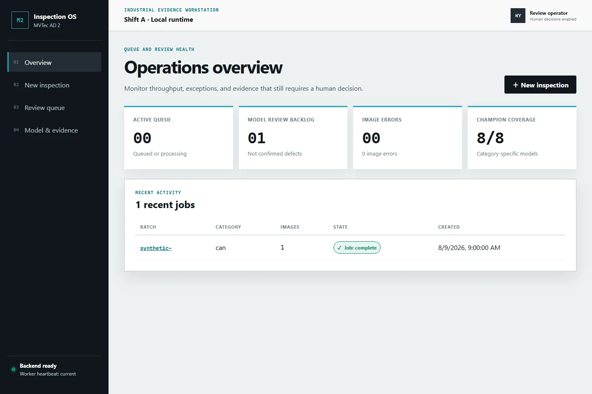
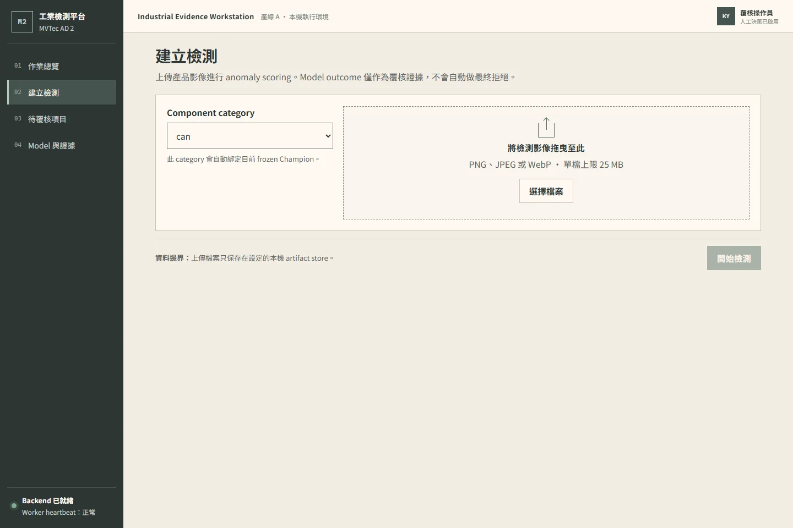
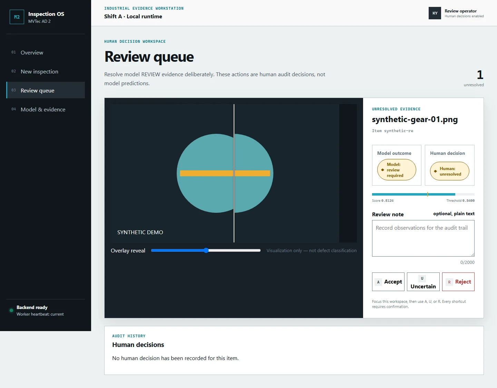
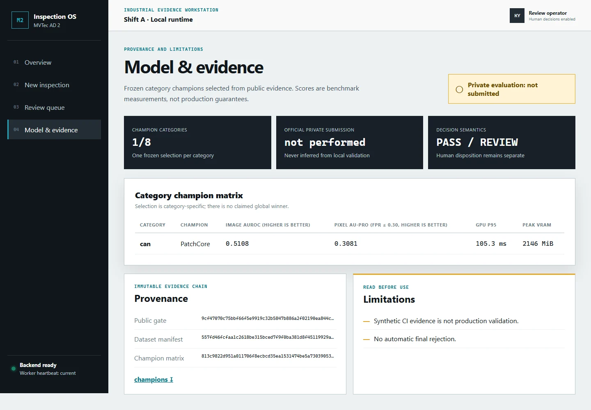
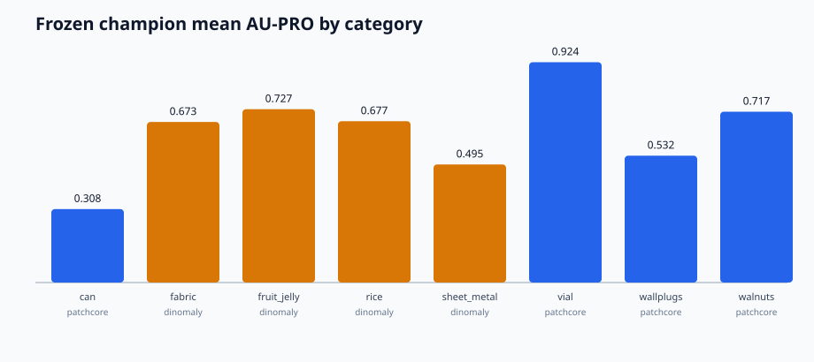

# MVTec AD 2 Industrial Inspection Platform


[](https://github.com/kuotunyu/mvtec-ad2-inspection-platform/actions/workflows/ci.yml)
[](LICENSE)


> Industrial anomaly detection research + evidence-driven inspection workstation

這是一個把 anomaly detection 研究接到可操作產品邊界的 local-first 專案：離線端比較 PatchCore、EfficientAD 與 Dinomaly，線上端提供可續跑 batch、視覺化證據、人工覆核與稽核報告。Repository 只用 `fixtures/public-demo` 產生公開畫面，不重新散布 MVTec 資料；官方 frozen private gate 的結論為 `PRIVATE-NO-GO`。

此 source tree 定義 `v0.1.0` stable software／workstation contract；實際 publication identity、source commit 與日期以 [`v0.1.0` Git tag 和 GitHub Release](https://github.com/kuotunyu/mvtec-ad2-inspection-platform/releases/tag/v0.1.0) 為 authoritative external record。[`v0.1.0-rc.1`](https://github.com/kuotunyu/mvtec-ad2-inspection-platform/releases/tag/v0.1.0-rc.1) 保留為 historical pre-release。這裡的 stable 只代表可重現的求職作品與 workstation contract，不改變模型的 `PRIVATE-NO-GO` 結論，也不代表 production deployment；公開內容不附 data、weights 或 private artifacts，也不授權 deployment、model publication 或第二次 submission。

---

## 專案重點

- **可追溯模型選擇：** 8 個 category-specific champions <!-- claim:8|reports/champions.json|/champions|len -->，選自 56 次 formal public runs <!-- claim:56|reports/public_benchmark.json|/runs|len -->；每個公開數字都連結 committed machine-readable evidence。
- **資源受限研究：** 以固定 gate 依序測試解析度與 coreset 取捨；成功降低 PatchCore artifact 與推論成本，但 multi-seed image AUROC 未通過重現性門檻，因此不更換 champion。
- **完整產品流程：** React 工作站、FastAPI、SQLite、leased worker、model registry、人工覆核與報告匯出。
- **Fail-closed 邊界：** 驗證 model identity、uploads、recovery、reports 與 deletion，並以 synthetic fixtures 完成 end-to-end 測試。
- **誠實揭露：** 官方結果不支持 v1 release，因此維持 `PRIVATE-NO-GO`，不以 private 結果 retune 或重新提交。

---

## 面試導覽

| 想檢視的能力 | 程式碼入口 | 可追溯證據 |
|---|---|---|
| Anomaly detection 與模型選擇 | [`experiments/`](experiments)、[`reports/`](reports) | [Model selection](docs/MODEL_SELECTION.md)、[benchmark](reports/benchmark.md) |
| Backend、worker 與資料契約 | [`apps/api/`](apps/api)、[`src/inspection_platform/`](src/inspection_platform) | [Architecture](docs/ARCHITECTURE.md)、[`tests/system/`](tests/system) |
| React 工作站與人機協作 | [`apps/web/src/`](apps/web/src) | [`apps/web/e2e/`](apps/web/e2e)、下方工作站巡覽 |
| Reproducibility、security 與 release engineering | [`compose.yaml`](compose.yaml)、[`.github/workflows/ci.yml`](.github/workflows/ci.yml)、[`scripts/`](scripts) | [Reproducibility](docs/REPRODUCIBILITY.md)、[Release checklist](docs/RELEASE_CHECKLIST.md) |

---

## 公開內容與證據邊界

| 範圍 | Repository 中的內容 | 可以解讀成什麼 |
|---|---|---|
| Synthetic public demo | 專案自行生成的影像、mock bundles、screenshots 與 CPU/Docker 測試 | 產品流程、恢復能力、安全邊界與 UI 可實際執行；不代表真實模型品質 |
| 使用者自行取得的 MVTec AD 2 | 下載、manifest 與外部路徑操作程式；不含原始影像或 masks | 可在接受官方授權後重現研究；Repository 本身不提供資料 |
| 已完成研究 | Sanitized public aggregates、champion matrix、資源限制與 serving evidence | 可追溯比較、選模、效能與工程取捨 |
| 未公開或未宣稱 | 不含 weights、checkpoints、raw private predictions 或第二次 submission | 不宣稱 production readiness、商用授權或有效的官方 thresholded F1 |

---

## 系統架構與 Pipeline

### 端到端工業檢測與人機協作流程


---

## 產品流程


操作人員選擇 category 並送出 batch；job、audit 與 images 在同一 transaction 公開，其中一張影像損壞時，其餘有效影像仍會繼續。獨占 lease 的 worker 在 inference 前驗證指定 model bundle，以獨立 heartbeat 續租，並用 worker、attempt generation、state 與到期時間做 database fence，才把 source、PNG anomaly-map、overlay 與 hashes 分別保存；租約失效後能 idempotent resume。模型證據只記為 `PASS` 或 `REVIEW`，最終處置由人員決定，所有報告分開保留模型判定與人工決策。

本 Repository 的 screenshots 全由 `fixtures/public-demo` 產生，不含 MVTec pixels，也不代表已部署於 production。

### 工作站巡覽

| 檢測作業總覽 | 安全批次匯入 |
|---|---|
|  |  |
| **人工覆核工作區** | **Model 與證據** |
|  |  |

---

## 證據，而非 leaderboard 宣稱

- Frozen champion matrix 位於 [reports/champions.json](reports/champions.json)，可讀摘要位於 [reports/benchmark.md](reports/benchmark.md)。
- Public selection 依 approved metric contract 同時考量 image AUROC、pixel AU-PRO、confidence intervals、latency、VRAM 與 artifact size。
- `can`、`vial`、`wallplugs`、`walnuts` 的 winner 是 PatchCore；`fabric`、`fruit_jelly`、`rice`、`sheet_metal` 的 winner 是 Dinomaly。
- EfficientAD 是已 benchmark 的 candidate，但未被選為 champion。
- 唯一一次獲授權的 frozen archive 通過官方 local validator 並由官方 server 評測；看到結果後沒有重建或重新提交。

Champion 比較只有 seeds 17、42、2026 三個獨立重複；paired bootstrap intervals 用來描述這三次結果的選模不確定性，不是正式推論保證，也沒有做 multiplicity correction。`test_public` 曾參與 iterative screening 與 champion selection，因此不是完全獨立 holdout；唯一獨立的 official private validation 仍是 `PRIVATE-NO-GO`，本專案不據此宣稱 private 泛化或 production model quality。



---

## Memory-bounded PatchCore 研究亮點

高解析度不是免費的品質提升：768 x 768 candidates 在 24 GiB RTX 4090 fitting 階段 OOM，640 x 640 frontier 雖改善 localization，卻增加延遲並降低 image AUROC。後續固定的 coreset ladder 先測 0.01，再依 gate 執行 0.02 rescue。

0.02 seed-42 candidate 的 AU-PRO 相對 baseline 增加 **0.0854** <!-- claim:0.0854|reports/memory_bounded_patchcore.json|/probes/1/comparison/au_pro_delta|.4f -->、GPU p95 為 **78.4 ms** <!-- claim:78.4|reports/memory_bounded_patchcore.json|/probes/1/comparison/candidate/gpu_p95_latency_ms|.1f -->，artifact 為 **330,255,411 bytes** <!-- claim:330,255,411|reports/memory_bounded_patchcore.json|/probes/1/comparison/candidate/artifact_size_bytes|,d -->。但 seeds 17 與 2026 的 image AUROC 都明顯退步，因此最終 verdict 是 `EFFICIENT_SEED42_ONLY`，不更換 frozen champion，也不推論 private performance。完整設計、重現方式與限制見 [Model selection](docs/MODEL_SELECTION.md)、[Experiment runbook](docs/EXPERIMENT_RUNBOOK.md) 與 [sanitized report](reports/memory_bounded_patchcore.json)。

---

## 官方 private gate

官方 server 回傳的 AucPro_0.05 average：`private` 為 **31.24** <!-- claim:31.24|docs/assets/evidence/official-private-result.json|/metrics/private/auc_pro_0_05/average|.2f -->，`private_mixed` 為 **29.81** <!-- claim:29.81|docs/assets/evidence/official-private-result.json|/metrics/private_mixed/auc_pro_0_05/average|.2f -->。依預先承諾的規則，material mixed-lighting failure 必須揭露而不能事後調整，因此分類為 `PRIVATE-NO-GO`。

提交的 archive 包含全部 4,090 張 TIFF anomaly maps，但沒有 optional thresholded PNGs。官方 ClassF1 與 SegF1 因此為零，不能解讀成 thresholded-map performance 的有效量測。經審查的 per-category aggregates 與 evidence hashes 位於 [official-private-result.json](docs/assets/evidence/official-private-result.json)；raw server evidence 保留在 Git 之外。

---

## 已驗證的本機 serving 效能

8 個 frozen champions 都在記錄的 RTX 4090 workstation 上通過 clean-process product inference。每個 category 使用 batch size **1** <!-- claim:1|docs/assets/evidence/serving-benchmark.json|/configuration/batch_size|d -->、**3** 次 warmups <!-- claim:3|docs/assets/evidence/serving-benchmark.json|/configuration/warmup_repetitions|d --> 與 **20** 次 timed GPU repetitions <!-- claim:20|docs/assets/evidence/serving-benchmark.json|/configuration/gpu_repetitions|d -->。以下是本機量測，不是 production guarantee。

| Category | Model family | GPU p50（ms） | GPU p95（ms） | Peak reserved VRAM（MiB） | Bundle bytes |
|---|---|---:|---:|---:|---:|
| can | PatchCore | 155.2 <!-- claim:155.2|docs/assets/evidence/serving-benchmark.json|/categories/can/gpu/p50_latency_ms|.1f --> | 173.2 <!-- claim:173.2|docs/assets/evidence/serving-benchmark.json|/categories/can/gpu/p95_latency_ms|.1f --> | 4388.0 <!-- claim:4388.0|docs/assets/evidence/serving-benchmark.json|/categories/can/gpu/peak_reserved_vram_mib|.1f --> | 3,409,718,327 <!-- claim:3,409,718,327|docs/assets/evidence/serving-benchmark.json|/categories/can/artifact_size_bytes|,d --> |
| fabric | Dinomaly | 167.4 <!-- claim:167.4|docs/assets/evidence/serving-benchmark.json|/categories/fabric/gpu/p50_latency_ms|.1f --> | 184.9 <!-- claim:184.9|docs/assets/evidence/serving-benchmark.json|/categories/fabric/gpu/p95_latency_ms|.1f --> | 2408.0 <!-- claim:2408.0|docs/assets/evidence/serving-benchmark.json|/categories/fabric/gpu/peak_reserved_vram_mib|.1f --> | 1,776,166,311 <!-- claim:1,776,166,311|docs/assets/evidence/serving-benchmark.json|/categories/fabric/artifact_size_bytes|,d --> |
| fruit jelly | Dinomaly | 66.9 <!-- claim:66.9|docs/assets/evidence/serving-benchmark.json|/categories/fruit_jelly/gpu/p50_latency_ms|.1f --> | 72.1 <!-- claim:72.1|docs/assets/evidence/serving-benchmark.json|/categories/fruit_jelly/gpu/p95_latency_ms|.1f --> | 2388.0 <!-- claim:2388.0|docs/assets/evidence/serving-benchmark.json|/categories/fruit_jelly/gpu/peak_reserved_vram_mib|.1f --> | 1,776,166,311 <!-- claim:1,776,166,311|docs/assets/evidence/serving-benchmark.json|/categories/fruit_jelly/artifact_size_bytes|,d --> |
| rice | Dinomaly | 170.4 <!-- claim:170.4|docs/assets/evidence/serving-benchmark.json|/categories/rice/gpu/p50_latency_ms|.1f --> | 177.2 <!-- claim:177.2|docs/assets/evidence/serving-benchmark.json|/categories/rice/gpu/p95_latency_ms|.1f --> | 2408.0 <!-- claim:2408.0|docs/assets/evidence/serving-benchmark.json|/categories/rice/gpu/peak_reserved_vram_mib|.1f --> | 1,776,166,311 <!-- claim:1,776,166,311|docs/assets/evidence/serving-benchmark.json|/categories/rice/artifact_size_bytes|,d --> |
| sheet metal | Dinomaly | 63.2 <!-- claim:63.2|docs/assets/evidence/serving-benchmark.json|/categories/sheet_metal/gpu/p50_latency_ms|.1f --> | 65.8 <!-- claim:65.8|docs/assets/evidence/serving-benchmark.json|/categories/sheet_metal/gpu/p95_latency_ms|.1f --> | 2402.0 <!-- claim:2402.0|docs/assets/evidence/serving-benchmark.json|/categories/sheet_metal/gpu/peak_reserved_vram_mib|.1f --> | 1,776,166,311 <!-- claim:1,776,166,311|docs/assets/evidence/serving-benchmark.json|/categories/sheet_metal/artifact_size_bytes|,d --> |
| vial | PatchCore | 101.3 <!-- claim:101.3|docs/assets/evidence/serving-benchmark.json|/categories/vial/gpu/p50_latency_ms|.1f --> | 111.9 <!-- claim:111.9|docs/assets/evidence/serving-benchmark.json|/categories/vial/gpu/p95_latency_ms|.1f --> | 3232.0 <!-- claim:3232.0|docs/assets/evidence/serving-benchmark.json|/categories/vial/gpu/peak_reserved_vram_mib|.1f --> | 2,496,191,543 <!-- claim:2,496,191,543|docs/assets/evidence/serving-benchmark.json|/categories/vial/artifact_size_bytes|,d --> |
| wallplugs | PatchCore | 134.9 <!-- claim:134.9|docs/assets/evidence/serving-benchmark.json|/categories/wallplugs/gpu/p50_latency_ms|.1f --> | 144.1 <!-- claim:144.1|docs/assets/evidence/serving-benchmark.json|/categories/wallplugs/gpu/p95_latency_ms|.1f --> | 3274.0 <!-- claim:3274.0|docs/assets/evidence/serving-benchmark.json|/categories/wallplugs/gpu/peak_reserved_vram_mib|.1f --> | 2,511,287,351 <!-- claim:2,511,287,351|docs/assets/evidence/serving-benchmark.json|/categories/wallplugs/artifact_size_bytes|,d --> |
| walnuts | PatchCore | 239.7 <!-- claim:239.7|docs/assets/evidence/serving-benchmark.json|/categories/walnuts/gpu/p50_latency_ms|.1f --> | 259.8 <!-- claim:259.8|docs/assets/evidence/serving-benchmark.json|/categories/walnuts/gpu/p95_latency_ms|.1f --> | 4610.0 <!-- claim:4610.0|docs/assets/evidence/serving-benchmark.json|/categories/walnuts/gpu/peak_reserved_vram_mib|.1f --> | 3,560,713,271 <!-- claim:3,560,713,271|docs/assets/evidence/serving-benchmark.json|/categories/walnuts/artifact_size_bytes|,d --> |

完整 sanitized artifact 另記錄 cold start、mean confidence intervals、throughput、CPU fallback、RSS、software versions、bundle identities 與 evidence hash manifest。

---

## 架構


API startup 不會 import training orchestration。Runtime databases、uploads、artifacts、datasets、checkpoints 與 real model bundles 全部位於 Git 之外。Docker 使用 digest-pinned multi-stage images、read-only root filesystem、unprivileged user、persistent runtime volumes 與 read-only model mount；multipart parser 與 validated-upload staging 共用獨立 disk-backed spool volume，啟動時會檢查其容量。預設 `compose.yaml` 是 CPU synthetic profile；formal NVIDIA worker 使用 `docker compose -f compose.yaml -f compose.gpu.yaml up --build`，且仍需外部 verified registry 與 NVIDIA Container Toolkit。

詳細資料請見 [Architecture](docs/ARCHITECTURE.md)、[Case study](docs/CASE_STUDY.md)、[Model card](docs/MODEL_CARD.md)、[Data card](docs/DATA_CARD.md)、[Security](docs/SECURITY.md) 與 [Limitations](docs/LIMITATIONS.md)。

---

## 執行 synthetic local demo

這個預設路徑只需要 Python 3.12、`uv` 與 Docker；不下載 MVTec AD 2、不執行 GPU 訓練，也不需要 real model weights。

```powershell
uv sync --frozen
$env:INSPECTION_MODEL_ROOT = Join-Path ([IO.Path]::GetTempPath()) "mvtec-ad2-demo-models"
uv run python scripts/build_demo_bundle.py --output $env:INSPECTION_MODEL_ROOT
docker compose up -d --build --wait
```

開啟 `http://127.0.0.1:8000`。以 `docker compose down` 停止服務；只有在確定要刪除該 Compose project 的 demo database 與 artifacts 時才加上 `--volumes`。

完整驗證與 real-model preparation 請依 [Reproducibility](docs/REPRODUCIBILITY.md) 和 [Remote setup](docs/REMOTE_SETUP.md) 操作。文件中的命令不會自行 push、publish、upload 或 submit。

---

## 判定語意

`PASS` 表示 frozen model score 低於其記錄 threshold；`REVIEW` 表示證據應由人員檢閱。兩者都不是 defect type、root cause 或 automatic reject decision。

---

## License 與資料邊界

Project source code 依 [MIT License](LICENSE) 提供。本 Repository 不重新散布 MVTec 原始資料；MVTec AD 2 data 另依 CC BY-NC-SA 4.0 授權。由該資料訓練的 model artifacts 僅視為 research／non-commercial portfolio artifacts，重用前請閱讀 [MODEL_CARD.md](docs/MODEL_CARD.md)。
