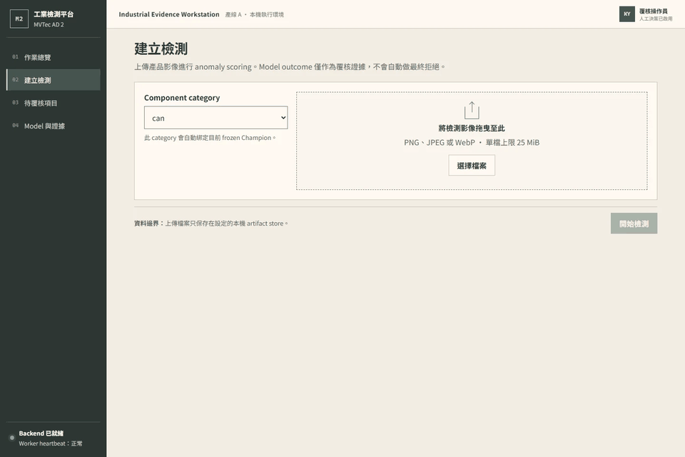
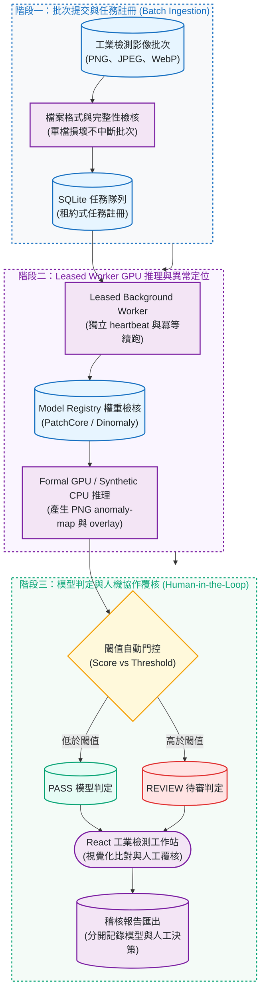

# MVTec AD 2 Industrial Inspection Platform

[](https://github.com/kuotunyu/mvtec-ad2-inspection-platform/actions/workflows/ci.yml)

[](LICENSE)

把一批產品照片上傳後，系統會排隊用異常檢測模型標出可疑區域，交給品管人員逐張覆核，並把模型判定與人工決定分開存成可稽核的報告；背景 worker 中途當機，重啟後會從中斷處接續，不重算、也不重複寫入。

> **TL;DR** — A local-first visual-inspection workstation: upload a batch → queued inference by a crash-safe leased worker (FastAPI + SQLite) → human review in a React UI → JSON/CSV/HTML audit reports. The models behind it come from a reproducible anomalib study (PatchCore / EfficientAD / Dinomaly) on MVTec AD 2.



*4.5 秒示範流程：批次匯入 → 作業總覽 → 檢測證據 → 人工覆核 → 模型證據。畫面全部來自專案自行產生的 synthetic 影像，展示的是產品流程，不是真實模型品質。*

## 重點結果

- **當機也接得回來的檢測流程**：FastAPI + SQLite 佇列；worker 以租約（lease）獨占任務、用獨立 heartbeat 續租。租約失效後由下一個 worker 接手，已完成的影像不重算，過期 worker 的寫入會被資料庫擋下；一張影像損壞也不會中斷整批。由 [`tests/system/`](tests/system) 與 Playwright [`apps/web/e2e/`](apps/web/e2e) 驗證。
- **8 個產品類別都有實際跑得動的模型**：單張 RTX 4090、batch size 1，每張影像的 GPU p95 延遲為 65.8 <!-- claim:65.8|docs/assets/evidence/serving-benchmark.json|/categories/sheet_metal/gpu/p95_latency_ms|.1f -->–259.8 ms <!-- claim:259.8|docs/assets/evidence/serving-benchmark.json|/categories/walnuts/gpu/p95_latency_ms|.1f -->，峰值 VRAM 為 2388.0 <!-- claim:2388.0|docs/assets/evidence/serving-benchmark.json|/categories/fruit_jelly/gpu/peak_reserved_vram_mib|.1f -->–4610.0 MiB <!-- claim:4610.0|docs/assets/evidence/serving-benchmark.json|/categories/walnuts/gpu/peak_reserved_vram_mib|.1f -->。
- **可追溯的選模研究**：比較 PatchCore、EfficientAD、Dinomaly，從 56 次正式 public 實驗 <!-- claim:56|reports/public_benchmark.json|/runs|len --> 逐類別選出 8 個模型 <!-- claim:8|reports/champions.json|/champions|len -->（PatchCore 與 Dinomaly 各 4 類），每個數字都能對回 repo 內的證據檔。
- **提高解析度沒有被採用**：768 x 768 讓 AU-PRO 提升 +0.0995 <!-- claim:0.0995|reports/high_resolution_patchcore_cloud.json|/comparisons/0/au_pro_delta|.4f -->（`can`）與 +0.1551 <!-- claim:0.1551|reports/high_resolution_patchcore_cloud.json|/comparisons/1/au_pro_delta|.4f -->（`wallplugs`），但 GPU p95 延遲 708.7 ms <!-- claim:708.7|reports/high_resolution_patchcore_cloud.json|/comparisons/0/candidate/gpu_p95_latency_ms|.1f --> 與 508.5 ms <!-- claim:508.5|reports/high_resolution_patchcore_cloud.json|/comparisons/1/candidate/gpu_p95_latency_ms|.1f --> 超過實驗前就訂好的 500 ms 上限，所以照原規則不換模型。

**連結：** [Release v0.1.2](https://github.com/kuotunyu/mvtec-ad2-inspection-platform/releases/tag/v0.1.2) · [Case study](docs/CASE_STUDY.md) · [Architecture](docs/ARCHITECTURE.md) · [選模方法](docs/MODEL_SELECTION.md)。[線上 demo（Hugging Face Space）](https://huggingface.co/spaces/steven0226/mvtec-ad2-inspection-platform)使用 synthetic 影像與 mock 模型，只展示「上傳 → 排隊 → 當機可接續的 worker → 人工覆核 → 報告」這條流程，不代表真實模型品質。本專案仍不發布模型權重；也可以用下面的本機 demo 體驗完整流程。

## 快速開始

這個 synthetic 本機 demo 只需要 Python 3.12、`uv` 與 Docker；不下載 MVTec AD 2、不執行 GPU 訓練，也不需要 real model weights。

```powershell
uv sync --frozen
$env:INSPECTION_MODEL_ROOT = Join-Path ([IO.Path]::GetTempPath()) "mvtec-ad2-demo-models"
uv run python scripts/build_demo_bundle.py --output $env:INSPECTION_MODEL_ROOT
docker compose up -d --build --wait
```

開啟 `http://127.0.0.1:8000`。以 `docker compose down` 停止服務；只有在確定要刪除該 Compose project 的 demo database 與 artifacts 時才加上 `--volumes`。

## 運作方式



操作人員選擇產品類別並送出一批影像；job、稽核紀錄與影像在同一個 transaction 內建立，其中一張影像損壞時，其餘有效影像照常處理。Worker 取得獨占租約後，先驗證指定的 model bundle 才開始推論，並以獨立 heartbeat 續租；每次寫入都要通過 worker、attempt generation、狀態與租約到期時間的資料庫檢查，過期的 worker 因此無法寫入結果，接手的 worker 會從中斷處接續（idempotent resume）。原圖、PNG anomaly map、overlay 與各自的 hash 分開保存。模型只給出 `PASS` 或 `REVIEW`，最終處置由人員決定，JSON/CSV/HTML 報告把兩者分開記錄。

Docker 使用 digest-pinned multi-stage images、read-only root filesystem 與非特權使用者；執行期的 database、uploads、artifacts 與 model bundles 全部在 Git 之外。預設 `compose.yaml` 是 CPU synthetic profile；正式的 NVIDIA worker 使用 `docker compose -f compose.yaml -f compose.gpu.yaml up --build`，另需外部已驗證的 model registry 與 NVIDIA Container Toolkit。元件細節與架構圖見 [Architecture](docs/ARCHITECTURE.md)。

| 檢測作業總覽 | 安全批次匯入 |
|---|---|
|  |  |
| **人工覆核工作區** | **Model 與證據** |
|  |  |

## 結果

### 平台：本機 serving 實測

8 個選定模型都在記錄的 RTX 4090 workstation 上通過 clean-process product inference。每個 category 使用 batch size **1** <!-- claim:1|docs/assets/evidence/serving-benchmark.json|/configuration/batch_size|d -->、**3** 次 warmups <!-- claim:3|docs/assets/evidence/serving-benchmark.json|/configuration/warmup_repetitions|d --> 與 **20** 次 timed GPU repetitions <!-- claim:20|docs/assets/evidence/serving-benchmark.json|/configuration/gpu_repetitions|d -->。

| Category | Model family | GPU p50（ms） | GPU p95（ms） | Peak reserved VRAM（MiB） | Bundle bytes |
|---|---|---:|---:|---:|---:|
| can | PatchCore | 155.2 <!-- claim:155.2|docs/assets/evidence/serving-benchmark.json|/categories/can/gpu/p50_latency_ms|.1f --> | 173.2 <!-- claim:173.2|docs/assets/evidence/serving-benchmark.json|/categories/can/gpu/p95_latency_ms|.1f --> | 4388.0 <!-- claim:4388.0|docs/assets/evidence/serving-benchmark.json|/categories/can/gpu/peak_reserved_vram_mib|.1f --> | 3,409,718,327 <!-- claim:3,409,718,327|docs/assets/evidence/serving-benchmark.json|/categories/can/artifact_size_bytes|,d --> |
| fabric | Dinomaly | 167.4 <!-- claim:167.4|docs/assets/evidence/serving-benchmark.json|/categories/fabric/gpu/p50_latency_ms|.1f --> | 184.9 <!-- claim:184.9|docs/assets/evidence/serving-benchmark.json|/categories/fabric/gpu/p95_latency_ms|.1f --> | 2408.0 <!-- claim:2408.0|docs/assets/evidence/serving-benchmark.json|/categories/fabric/gpu/peak_reserved_vram_mib|.1f --> | 1,776,166,311 <!-- claim:1,776,166,311|docs/assets/evidence/serving-benchmark.json|/categories/fabric/artifact_size_bytes|,d --> |
| fruit jelly | Dinomaly | 66.9 <!-- claim:66.9|docs/assets/evidence/serving-benchmark.json|/categories/fruit_jelly/gpu/p50_latency_ms|.1f --> | 72.1 <!-- claim:72.1|docs/assets/evidence/serving-benchmark.json|/categories/fruit_jelly/gpu/p95_latency_ms|.1f --> | 2388.0 <!-- claim:2388.0|docs/assets/evidence/serving-benchmark.json|/categories/fruit_jelly/gpu/peak_reserved_vram_mib|.1f --> | 1,776,166,311 <!-- claim:1,776,166,311|docs/assets/evidence/serving-benchmark.json|/categories/fruit_jelly/artifact_size_bytes|,d --> |
| rice | Dinomaly | 170.4 <!-- claim:170.4|docs/assets/evidence/serving-benchmark.json|/categories/rice/gpu/p50_latency_ms|.1f --> | 177.2 <!-- claim:177.2|docs/assets/evidence/serving-benchmark.json|/categories/rice/gpu/p95_latency_ms|.1f --> | 2408.0 <!-- claim:2408.0|docs/assets/evidence/serving-benchmark.json|/categories/rice/gpu/peak_reserved_vram_mib|.1f --> | 1,776,166,311 <!-- claim:1,776,166,311|docs/assets/evidence/serving-benchmark.json|/categories/rice/artifact_size_bytes|,d --> |
| sheet metal | Dinomaly | 63.2 <!-- claim:63.2|docs/assets/evidence/serving-benchmark.json|/categories/sheet_metal/gpu/p50_latency_ms|.1f --> | 65.8 <!-- claim:65.8|docs/assets/evidence/serving-benchmark.json|/categories/sheet_metal/gpu/p95_latency_ms|.1f --> | 2402.0 <!-- claim:2402.0|docs/assets/evidence/serving-benchmark.json|/categories/sheet_metal/gpu/peak_reserved_vram_mib|.1f --> | 1,776,166,311 <!-- claim:1,776,166,311|docs/assets/evidence/serving-benchmark.json|/categories/sheet_metal/artifact_size_bytes|,d --> |
| vial | PatchCore | 101.3 <!-- claim:101.3|docs/assets/evidence/serving-benchmark.json|/categories/vial/gpu/p50_latency_ms|.1f --> | 111.9 <!-- claim:111.9|docs/assets/evidence/serving-benchmark.json|/categories/vial/gpu/p95_latency_ms|.1f --> | 3232.0 <!-- claim:3232.0|docs/assets/evidence/serving-benchmark.json|/categories/vial/gpu/peak_reserved_vram_mib|.1f --> | 2,496,191,543 <!-- claim:2,496,191,543|docs/assets/evidence/serving-benchmark.json|/categories/vial/artifact_size_bytes|,d --> |
| wallplugs | PatchCore | 134.9 <!-- claim:134.9|docs/assets/evidence/serving-benchmark.json|/categories/wallplugs/gpu/p50_latency_ms|.1f --> | 144.1 <!-- claim:144.1|docs/assets/evidence/serving-benchmark.json|/categories/wallplugs/gpu/p95_latency_ms|.1f --> | 3274.0 <!-- claim:3274.0|docs/assets/evidence/serving-benchmark.json|/categories/wallplugs/gpu/peak_reserved_vram_mib|.1f --> | 2,511,287,351 <!-- claim:2,511,287,351|docs/assets/evidence/serving-benchmark.json|/categories/wallplugs/artifact_size_bytes|,d --> |
| walnuts | PatchCore | 239.7 <!-- claim:239.7|docs/assets/evidence/serving-benchmark.json|/categories/walnuts/gpu/p50_latency_ms|.1f --> | 259.8 <!-- claim:259.8|docs/assets/evidence/serving-benchmark.json|/categories/walnuts/gpu/p95_latency_ms|.1f --> | 4610.0 <!-- claim:4610.0|docs/assets/evidence/serving-benchmark.json|/categories/walnuts/gpu/peak_reserved_vram_mib|.1f --> | 3,560,713,271 <!-- claim:3,560,713,271|docs/assets/evidence/serving-benchmark.json|/categories/walnuts/artifact_size_bytes|,d --> |

[完整量測檔](docs/assets/evidence/serving-benchmark.json)另記錄 cold start、mean confidence intervals、throughput、CPU fallback、RSS、software versions、bundle identities 與各檔案的 hash。

### 模型研究：逐類別選模

- 選模依核定的 metric contract，同時考量 image AUROC、pixel AU-PRO、confidence intervals、latency、VRAM 與 artifact size（見[選模方法](docs/MODEL_SELECTION.md)）。
- `can`、`vial`、`wallplugs`、`walnuts` 選出 PatchCore；`fabric`、`fruit_jelly`、`rice`、`sheet_metal` 選出 Dinomaly。EfficientAD 完成了同樣的 benchmark，但沒有在任何類別勝出。
- 各類別的選定結果在 [reports/champions.json](reports/champions.json)，可讀摘要在 [reports/benchmark.md](reports/benchmark.md)。


### 提高解析度：定位變準，但延遲超標，所以不採用

把 PatchCore 輸入提高到 768 x 768，在 24 GiB RTX 4090 上 fitting 階段就 OOM；同一份程式、seed 與 config 改在 80 GiB A100 上完成，訓練峰值為 **44,593 MiB** <!-- claim:44,593|reports/high_resolution_patchcore_cloud_environment.json|/training_peak_vram_mib/can|,.0f --> 與 **31,741 MiB** <!-- claim:31,741|reports/high_resolution_patchcore_cloud_environment.json|/training_peak_vram_mib/wallplugs|,.0f -->。

| Category | AU-PRO | pixel AUROC | image AUROC | GPU p95 | 推論 VRAM |
|---|---|---|---|---|---|
| `can` | 0.3113 → 0.4109（**+0.0995** <!-- claim:0.0995|reports/high_resolution_patchcore_cloud.json|/comparisons/0/au_pro_delta|.4f -->） | +0.0545 | −0.0123 | **708.7 ms** <!-- claim:708.7|reports/high_resolution_patchcore_cloud.json|/comparisons/0/candidate/gpu_p95_latency_ms|.1f --> | 4,669 MiB |
| `wallplugs` | 0.5286 → 0.6837（**+0.1551** <!-- claim:0.1551|reports/high_resolution_patchcore_cloud.json|/comparisons/1/au_pro_delta|.4f -->） | +0.0259 | +0.0104 | **508.5 ms** <!-- claim:508.5|reports/high_resolution_patchcore_cloud.json|/comparisons/1/candidate/gpu_p95_latency_ms|.1f --> | 3,383 MiB |

定位品質確實變好，是本專案單純改變輸入幾何得到的最大增益；但 GPU p95 延遲超過實驗前就寫進 `classify_study` 的 500 ms serving 上限，所以一個模型都沒換（報告中的判定代碼為 `RESOURCE_LIMIT_EXCEEDED`）。這是延遲問題而不是記憶體問題：memory bank 與每張影像的 patch 數都隨解析度變大，最近鄰搜尋約需 4.8 倍的距離計算量。完整過程見 [解析度與 memory bank 研究](docs/RESOLUTION_STUDY.md) 與 [study report](reports/high_resolution_patchcore_cloud.json)。

### 縮小 memory bank：只在一個 seed 成立，所以不採用

在固定的 640 x 640 下把 coreset 比例降到 0.02，seed 42 的 AU-PRO 相對 baseline 增加 **0.0854** <!-- claim:0.0854|reports/memory_bounded_patchcore.json|/probes/1/comparison/au_pro_delta|.4f -->、GPU p95 為 **78.4 ms** <!-- claim:78.4|reports/memory_bounded_patchcore.json|/probes/1/comparison/candidate/gpu_p95_latency_ms|.1f -->，artifact 為 **330,255,411 bytes** <!-- claim:330,255,411|reports/memory_bounded_patchcore.json|/probes/1/comparison/candidate/artifact_size_bytes|,d -->。但 seeds 17 與 2026 的 image AUROC 都明顯退步，因此不更換選定模型（[報告](reports/memory_bounded_patchcore.json)中的判定代碼為 `EFFICIENT_SEED42_ONLY`）。

### 官方 private 評測

唯一一次獲授權的提交通過官方 local validator 後由官方 server 評測：官方 private 評測平均 AucPro_0.05 為 **31.24** <!-- claim:31.24|docs/assets/evidence/official-private-result.json|/metrics/private/auc_pro_0_05/average|.2f -->，混合光源的 `private_mixed` 為 **29.81** <!-- claim:29.81|docs/assets/evidence/official-private-result.json|/metrics/private_mixed/auc_pro_0_05/average|.2f -->，未通過本專案提交前就訂好的標準，因此沒有把這組模型當成可正式發布的成果；看到結果後也沒有回頭調整或再次提交（證據檔的 `verdict` 欄位記為 `PRIVATE-NO-GO`）。

提交的 archive 包含全部 4,090 張 TIFF anomaly maps，但沒有 optional thresholded PNGs，官方 ClassF1 與 SegF1 因此為零，不能解讀成 thresholded-map performance 的有效量測。各類別的數字在 [official-private-result.json](docs/assets/evidence/official-private-result.json)；raw server evidence 保留在 Git 之外。

## 適用範圍與限制

- **Demo 是 synthetic 的**：截圖、GIF 與預設 demo 全由 `fixtures/public-demo` 產生，不含 MVTec pixels；它證明流程、恢復與邊界處理可以實際執行，不代表真實模型品質，也不是 production 部署。
- **Repository 不含資料與權重**：沒有 MVTec 原始資料、weights、checkpoints 或 raw private predictions；要重現研究，需自行依官方授權取得 MVTec AD 2。
- **選模的統計強度有限**：只有 seeds 17、42、2026 三次獨立重複；paired bootstrap intervals 只描述這三次結果的不確定性，不是正式推論保證，也沒有做 multiplicity correction。`test_public` 參與過 iterative screening 與選模，不是獨立 holdout；唯一獨立的評測就是上面的官方 private 結果，本專案不據此宣稱 private 泛化或 production model quality。
- **效能數字只適用於量測環境**：serving 數字是單一 RTX 4090 workstation 的本機量測，不是 production guarantee。768 x 768 研究是 single-seed，其 latency 與 VRAM 在 A100 上量測，不可與 RTX 4090 的數字相比，只有品質差異與硬體無關。
- **`PASS` / `REVIEW` 不是瑕疵判定**：`PASS` 表示 model score 低於其記錄的 threshold，`REVIEW` 表示應由人員檢閱；兩者都不是 defect type、root cause 或 automatic reject decision。
- **Drift 工具沒有實測報告**：[離線 anomaly-score drift 工具](docs/DRIFT.md)只用 synthetic artifacts 驗證，Repository 沒有提交實測的 lighting drift report，PSI 分級也不是已校準的 production 門檻。
- **版本**：[`v0.1.2`](https://github.com/kuotunyu/mvtec-ad2-inspection-platform/releases/tag/v0.1.2) 是 source-only 維護版，沒有重跑 GPU serving 檢查；[`v0.1.0`](https://github.com/kuotunyu/mvtec-ad2-inspection-platform/releases/tag/v0.1.0) 是最後一次記錄 8/8 GPU serving 實測的版本，[`v0.1.0-rc.1`](https://github.com/kuotunyu/mvtec-ad2-inspection-platform/releases/tag/v0.1.0-rc.1) 為歷史版本。

完整清單見 [Limitations](docs/LIMITATIONS.md)。

## 重現

完整驗證（Python、frontend、Docker 檢查）與 real-model preparation 請依 [Reproducibility](docs/REPRODUCIBILITY.md) 和 [Remote setup](docs/REMOTE_SETUP.md) 操作；README 的數字可用 `uv run python scripts/verify_claims.py` 對回證據檔。文件中的命令不會自行 push、publish、upload 或 submit。

## License 與資料

Project source code 依 [MIT License](LICENSE) 提供。本 Repository 不重新散布 MVTec 原始資料；MVTec AD 2 data 另依 CC BY-NC-SA 4.0 授權。由該資料訓練的 model artifacts 僅視為 research／non-commercial portfolio artifacts，重用前請閱讀 [MODEL_CARD.md](docs/MODEL_CARD.md)。

## 延伸閱讀

- [專案導覽](docs/PROJECT_GUIDE.md)：依職務方向的閱讀路線、版本狀態、公開內容範圍、產品流程圖
- [Case study](docs/CASE_STUDY.md) · [Architecture](docs/ARCHITECTURE.md) · [Security](docs/SECURITY.md)
- [選模方法](docs/MODEL_SELECTION.md) · [Experiment runbook](docs/EXPERIMENT_RUNBOOK.md) · [解析度與 memory bank 研究](docs/RESOLUTION_STUDY.md)
- [Model card](docs/MODEL_CARD.md) · [Data card](docs/DATA_CARD.md) · [Limitations](docs/LIMITATIONS.md)
- [離線 anomaly-score drift 工具](docs/DRIFT.md) · [Release checklist](docs/RELEASE_CHECKLIST.md) · [Changelog](CHANGELOG.md)
